# Yum Byte :ramen:

- This app is :warning: **work in progress** :construction: :warning: recipe finder app which get data from [Spoonacular](https://spoonacular.com/food-api/docs)

## Development setup

- Download latest [Android studio](https://developer.android.com/studio)
- Get API key from [Spoonacular](https://spoonacular.com/food-api/docs)
- Add api key in `~/.gradle/gradle.properties`

```groovy
SPOONACULAR_KEY=your-api-key
```

## Screens

|Explore 1|Explore 2|Detail overview|Detail ingredients|Detail instruction|
|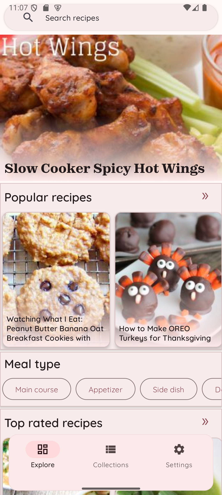|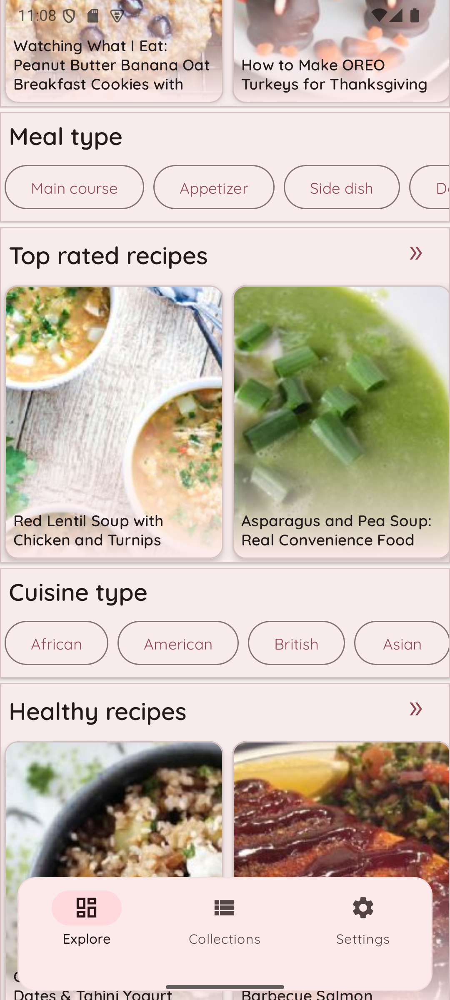|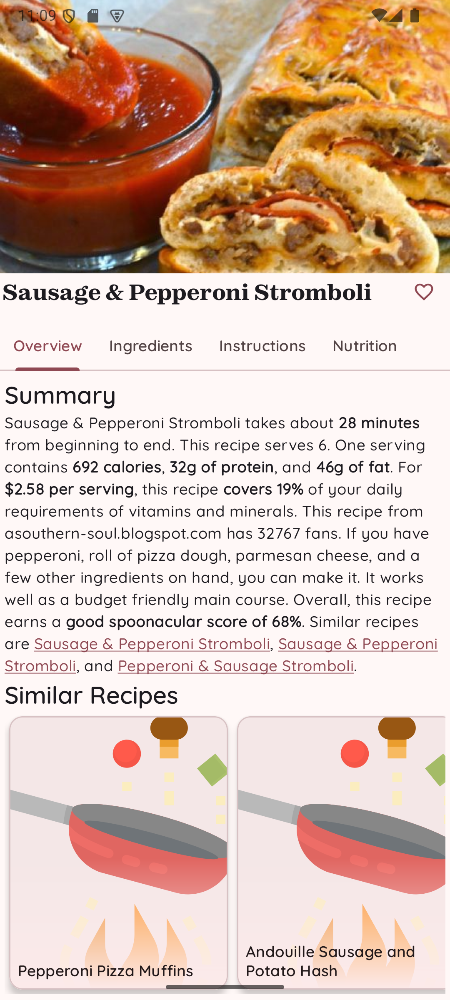|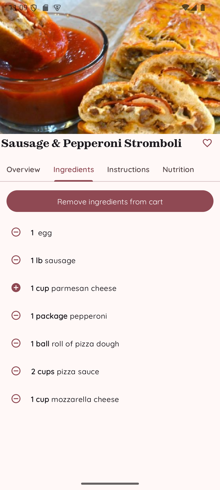|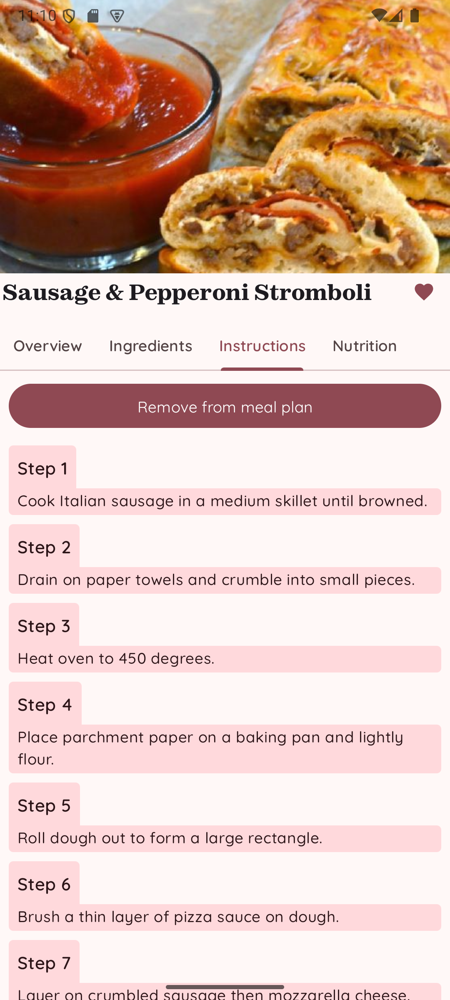
|View all portrait|View all landscape|Cart recipe|Cart aisle|
|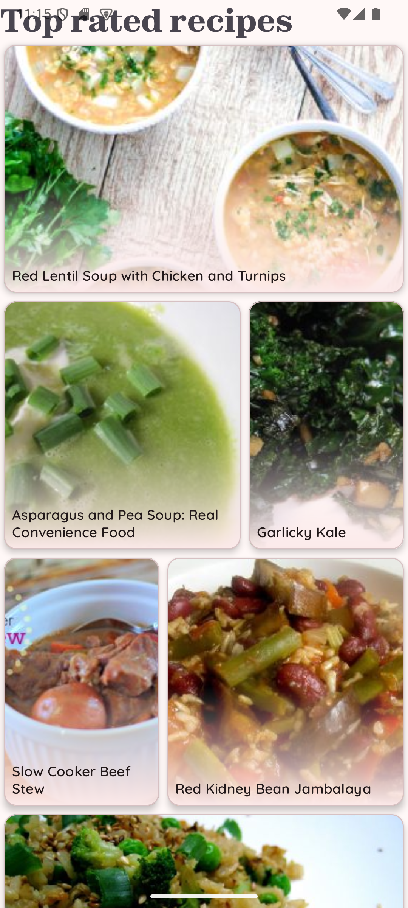|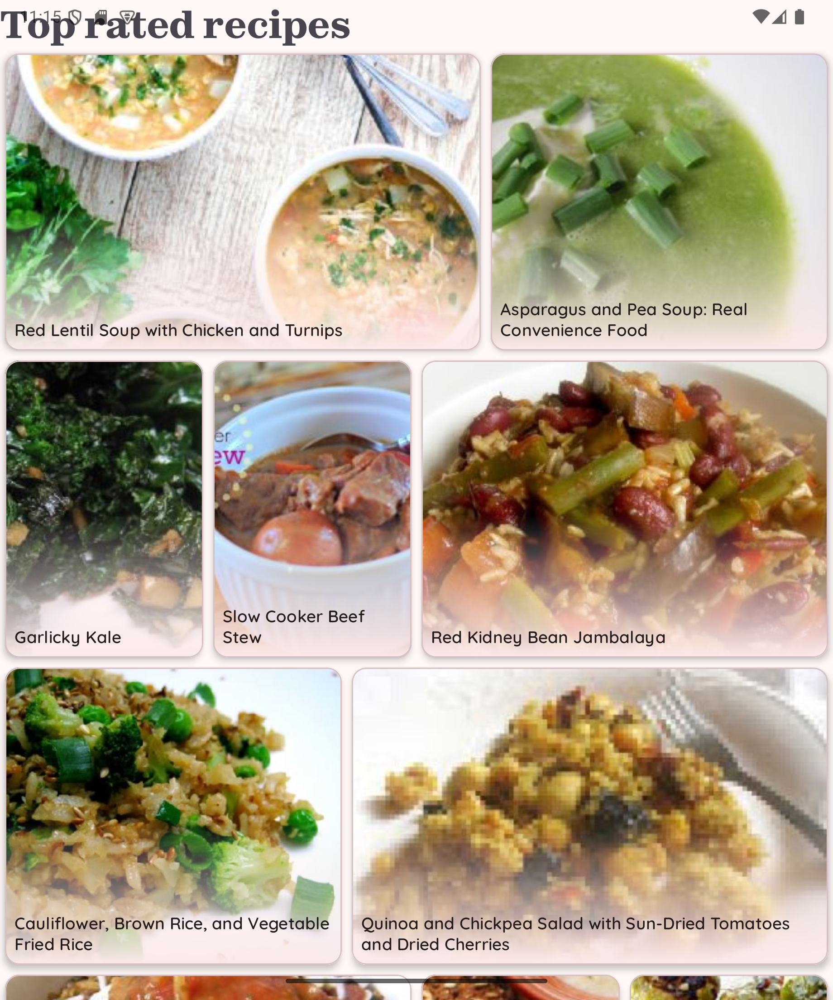|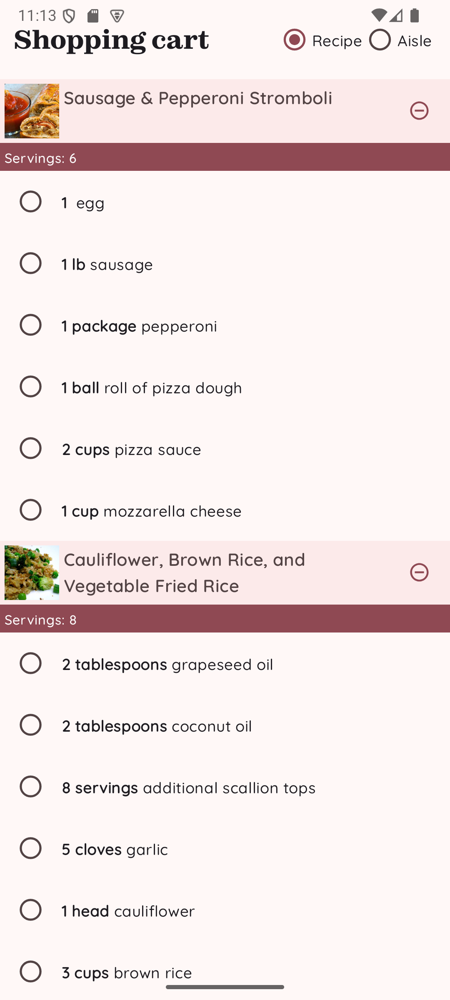|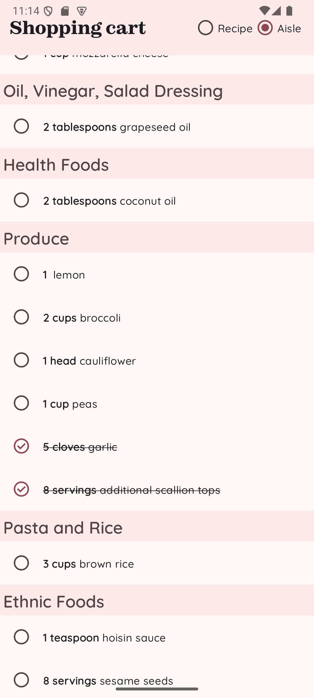|
|Today plan|Week plan|Unschedule recipes|Schedule recipe|
|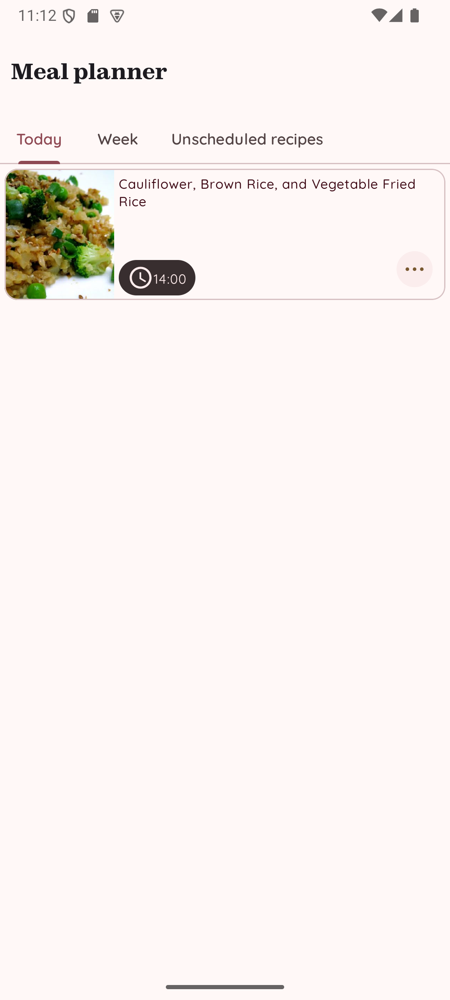|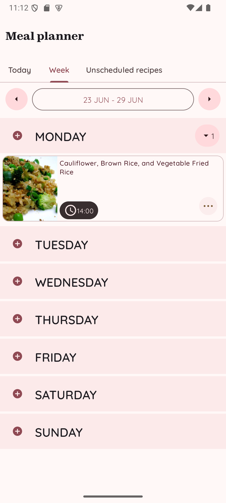|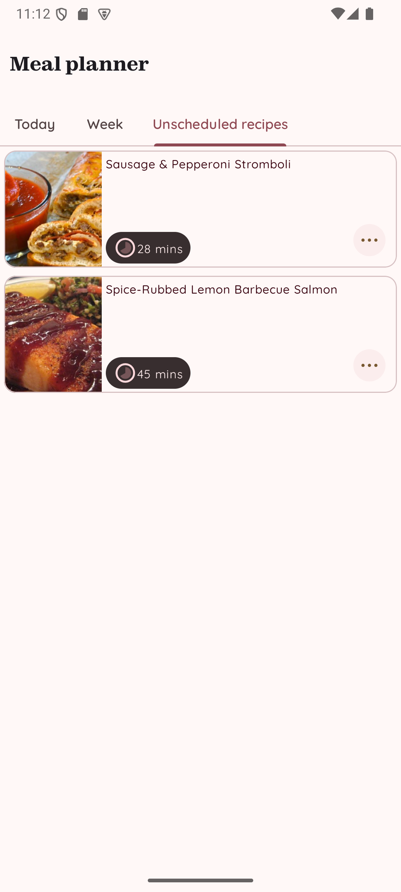|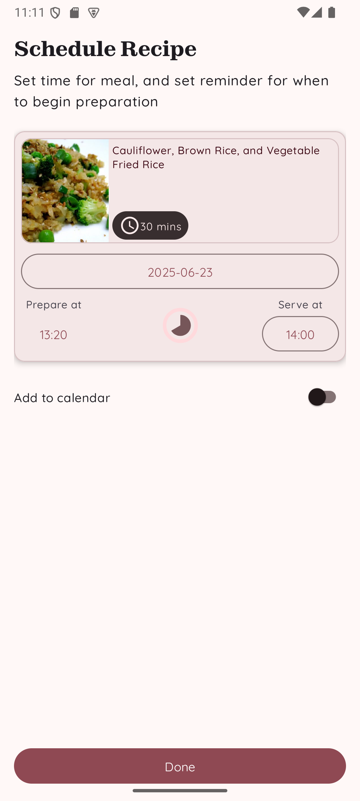|
